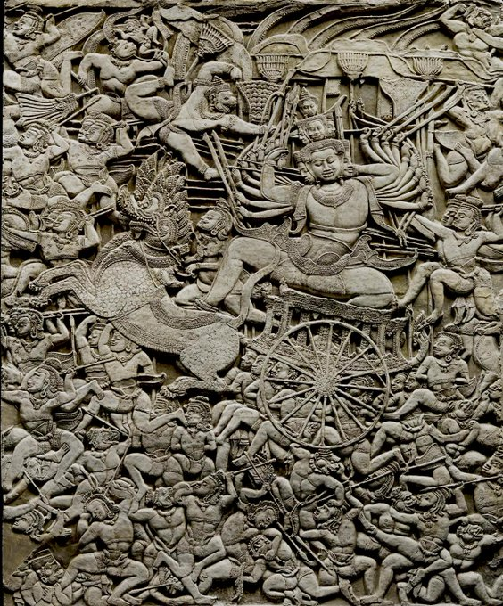
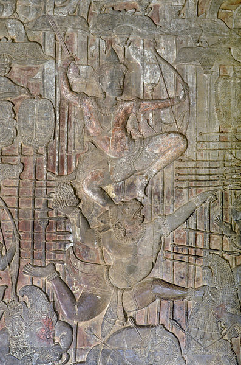
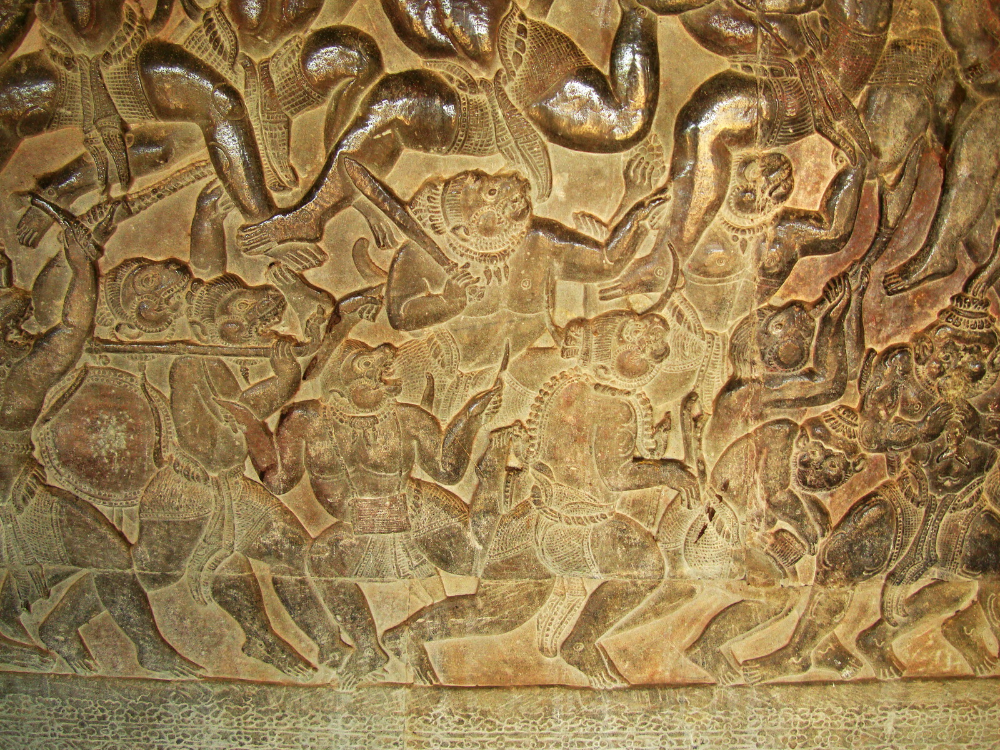
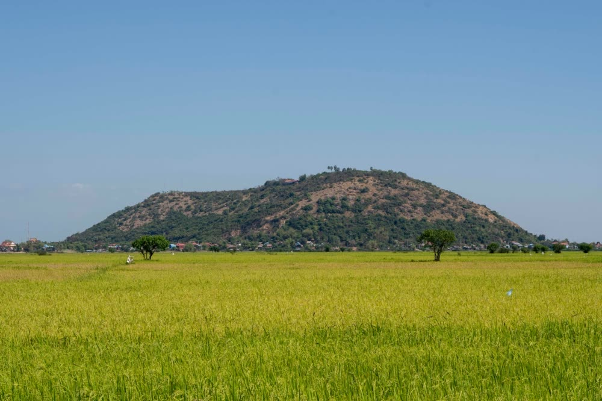
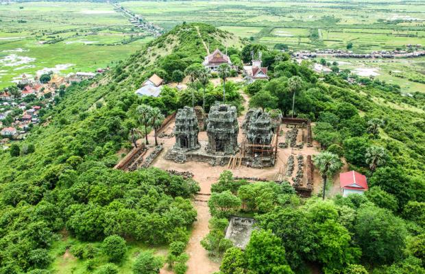

# Prototype Four: Angkor Wat's Bas-Relief 

## War of Lanka

Above is an image of a bas-relief on the wall of Angkor Wat. It shows the Battle of Lanka, which is a part of the ancient Hindu epic called *Ramayana*. The battle is fought so Prince Rama can rescue his wife, who is held in captive by the demon king Ravana (depicted in the bas-relief as a being with a thousand hands and a thousand arms). The battle is a clash between two great armies: Rama's army, which is consisted of people and monkeys, and Rava's army, which is consisted of demons. Thus, it respresents the clash between good and evil.
   

     
*Ramayana* is an Hindu epic originated in India. In Cambodia, we call the epic *Reamker*, which is based on the *Ramayana* epic but has additional stories. One of those additional stories is the story about the origin of a mountain called Phnom Kraom, which locates in my province. In the Battle of Lanka, Prince Rama's brother Praeh Leak is mortally wounded by a magical arrow. To cure him, the most powerful monkey named Hanuman is instructed to fetch a herb from a mountain. Hanuman does not know the right plant to get, so he returns with the whole moutain with him. Once the right herb is picked, Hanuman starts to fly back to put the moutain back in its original position. However, the great monkey is lazy to fly all the way back, so Hanuman throws the mountain from the sky to the ground. This mountain lands upside-down, so it is called Phnom Kraom until today (Phnom means mountain and Kraom means upside-down).

<!--  -->

## Phnom Kraom (The Upside-down Moutain)

