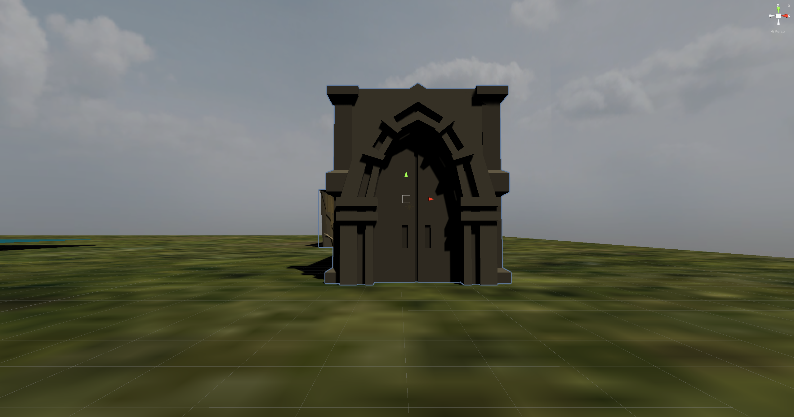
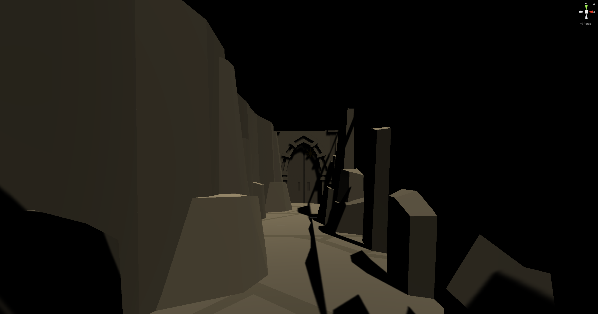

# Prototype Four: Stories of Angkor Wat (Continued) 

For this week prototype, I was working on my father's favorite myth about Angkor Wat. I still remember hearing this story when I was a kid because it made me fantasize that I could one day become a hero. And I still dream that I could. So, my father told me that deep within the temple, lie a powerful sword and an unbreakable armor. These items only reveal themselves when the right person, (in my head, a hero), comes to seek for them. The person must have a rightous heart heart and a pure soul to be able to yield the sword and wear the armor. Reading what I just wrote made me realize that maybe he's telling me the story to trick me to become a good person, knowing that I probably want to obtain those magical items. However, a part of me belives and will always believe that he truly believes the story because in adajcent to this story and other myths, he would tell me about his real life struggles to survive during and after the Khmer Rouge regime. 

Talking about his life during and after the Khmer Rouge era has never been easy because it is unimaginable what kinds of horror he went through. It was the darkest time in Cambodian history where a mass genocide of 2 million people happened. People were killed, starved and overworked to death. Some died from illness and malnutrition. My father told me how fortunate he was to survive through all of these terrors. When this regime immediately ended, his life was still in peril. Peace had not been established, so fighting between soldiers and militants happpened every day. Thus, when my father traveled to far away places, his life hung on a thread. He told stories of how he could feel bullets fly around him when shootings happened around him and he was only "the width of a hair" from death. However, time and time he was able to escape from those dangers,. 

## Working with Unity
I used existing to create a prototype of what the hidden sword and armor scene could look like. 

Players would be traveling in a boat when a mysterious entrance popped in front of them. 
   

Once players entered the entrance, they would be teleported to another place. In front of them stood another entrance. 
   

The doors would only open after players proved their worth. The method to determine their worthiness is a work in progress. 
   

Players would then need to travel through the hall way to get to another entrance and enter a secret room. 
   

Inside the secret, the magical sword and shield (armor) would present themselves in front of players. 
   

An overview of the path to the secret room
