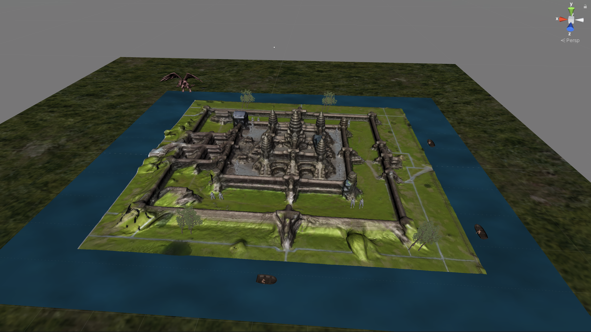

# Prototype One: Back to the Acient Time

## Description
For my first prototype, I used an existing model of Angkor Wat to represent what my final capstone project might look like. I used this model to create a virtual place to virtually teleport users back in time to when Angkor Wat was constructed. The players will embark They will embark on an adventure to discover various untold stories regarding this ancient temple and its people. Various parts of this place contain different scenes and stories that players can interact with. For example, players might come across a dragon as they are traveling in a boat around the temple (see images below). The players will have options to avoid or interact with this dragon to figure out its back story.

Through Augmented Reality and Virtual Reality, the audience will be teleported in time to ancient Angkor Wat, a prominent monument of the Khmer Empire. They will embark on an adventure to discover various untold stories regarding this ancient temple. The users can navigate around 

This project is inspired by my personal connection to this place. I always want to know what it was like to live during that time. There are so many myths and stories regarding this place

<!-- 

 -->
## Images

*Overview*

*Topview*

*Sideview*

*Frontview*

*Temples Scene*

*Mystical Creature Scene*

*Boat Racing Scene*

