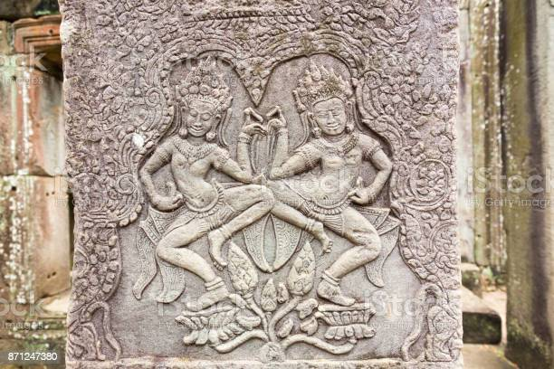
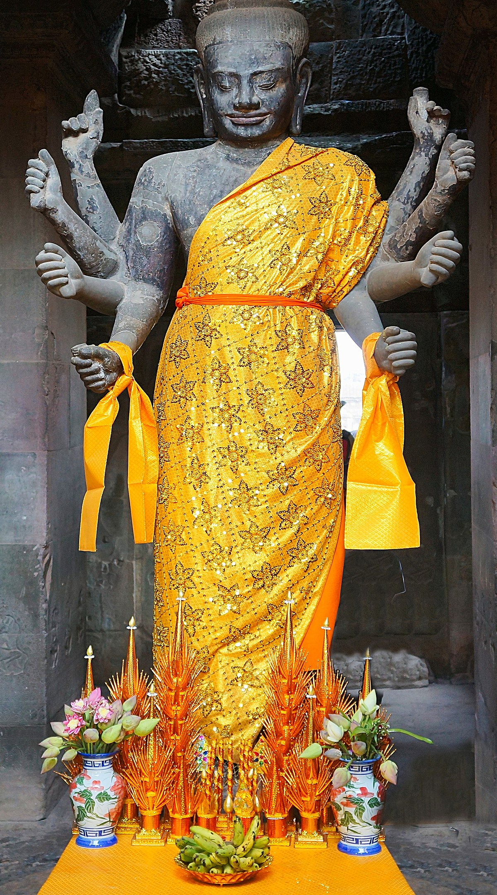

# Prototype Three: Stories of Angkor Wat (Continued) 
Last Friday, I was doing my weekly Skype with my family and, unintentionally but naturally, the topic of Angkor Wat came into our conversation. Initially, we were talking about how the Covid pandemic made the tourism back home look very dire. Since Angkor Wat is a big part of tourism, we could not avoid including the name in our conversation. However, the conversation took a sudden turn when my father switched from talking about the current Covid situation to talking about how Angkor Wat has been able to stand until today. So the tale of how Angkor Wat was built and how it is still able to withstand time and destruction begins:

## Myth of the Magical Lotus Leaf
Angkor Wat is surrounded by 

## The Watcher

My mother, on the other hand, knows several stories of her own. The one that she keeps telling us is the story of the Watcher whose statue is located at one of the entrances of Angkor Wat. He is known as the Watcher because he sees and knows everything that is happening in the universe. People would come to pray to him to watch over and keep them them as they travel to far away places. My mother would always bring me to pray to him before I went back home and when I flew back to school.

