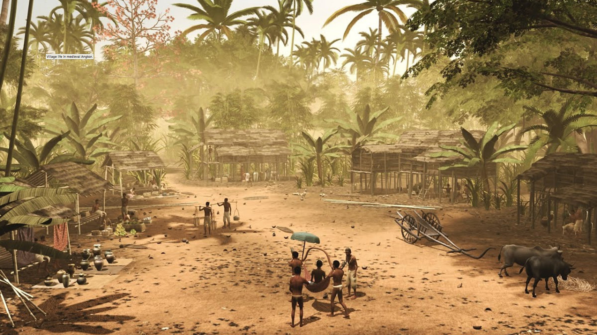

# Prototype Two: 

For my second prototype, I focused on the interaction and animation aspects of my capstone project. My first prototype mainly focused on the layout and the space of my overall project. Thus, when I was presenting my first prototype, people admired how things looked but they had questions regarding how players will interact with the spaces and characters. For example, when people saw the scene of the temple with a dragon, they wondered what players will do with that dragon. Will they fight the dragon or just passively observe what's happening around them? I needed to ponder this question deeply because the role of players in this simulation/game is essential to the narrative of the place.

Initially, I thought that players will be just observers. They will have the freedom to move around in the provided space and see what's happening around them. As I started working and getting feedback from other people, I think it would be a good idea to give them the freedom to be involved in stories as well. For example, players have the freedom to either passively watch a dragon burns down a village or they can step in and fight that dragon. Adding the interaction part will make the project more interesting, but I will not be able to tell my personal stories because players will create their own ones. 

## Stories
I was figuring out stories that I want to animate, so players can watch and interact with. I tried to remember stories told to me by my grandmother, parents, and elders. I also talked to my friends and did some research to find intriguing stories that could capture players' attention.

### Naga: Giant Serpents

Above is an image of a sculptures of a seven-headed naga, a giant mythical serpent that guards the entrance to the Angkor Wat Temple. They represent the guardians of the temple who prevent intruders from entering the temple. 
   

There are many great tales regarding these giant serpents in relation to Angkor Wat. My grandmother told that they used to roam around the temple to protect from enemies' invasion. She said that although we do not see them around us now, they still exist spiritually in the sculpures. 
   

To implement these tales into my project, I plan to create a 3D model of a naga (like the one above) so I can add animation to it. For example, when players arrive at the entrance of Angkor Wat, stone scuptures of nagas become alive and judge players' souls through series of questions. If players answered all the questions correctly, they would be granted access to the temple and able to explore further. Else, they would have to retreat or face the wrath of these giant snakes.
   

<!--  -->
### Daily Life

Another things that I want players to experience is the daily lives of people during that time. Growing up, I always try to imaginge what it was like living in that era. I heard stories of how people moved around with giant elephants, made masterful crafts by hands, and constructed Angkor Wat stone by stone. 
   

These images are taken from [Virtual Angkor Project](https://www.virtualangkor.com/), which created a virtual simulation of Angkor Wat and its people. The simulation gave me a visual of what my capstone project will look like and of how it will look different from this. For instance, the simulation focused only on telling the history of Angkor Wat and its people, which is quite informative. My project will build upon this by allowing players to experience living there through Virtual Reality. Players will see things through the eyes of Angkorian people (using VR to switch from third-person perspective to first-person perspective). 

## Modeling

