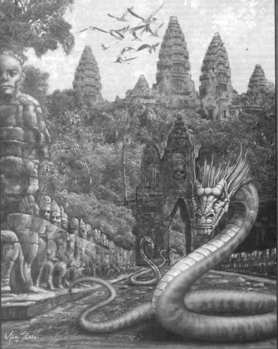
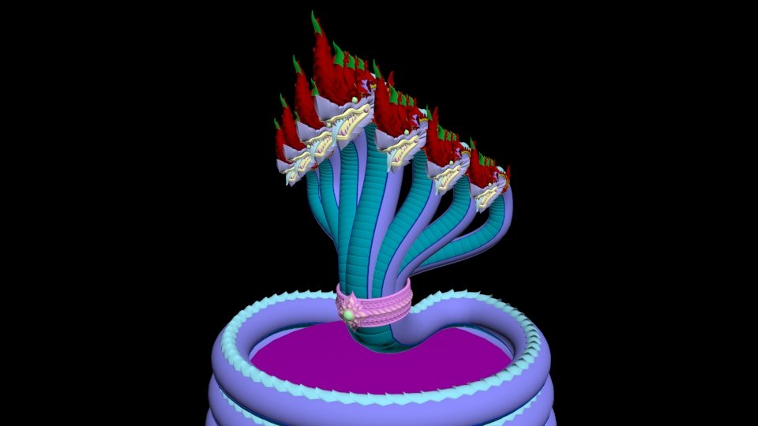
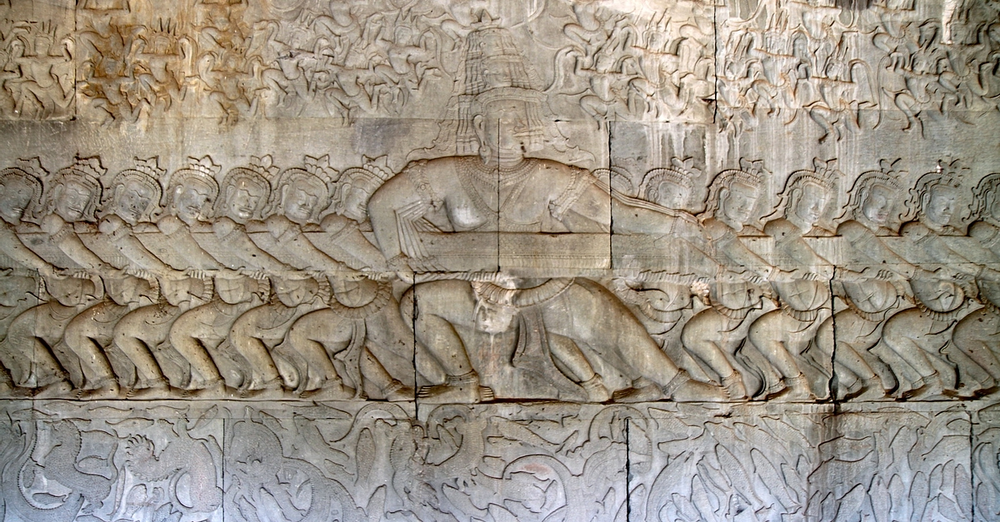
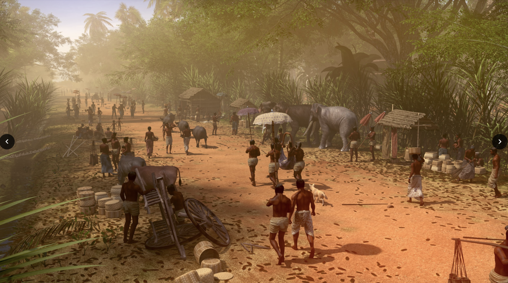
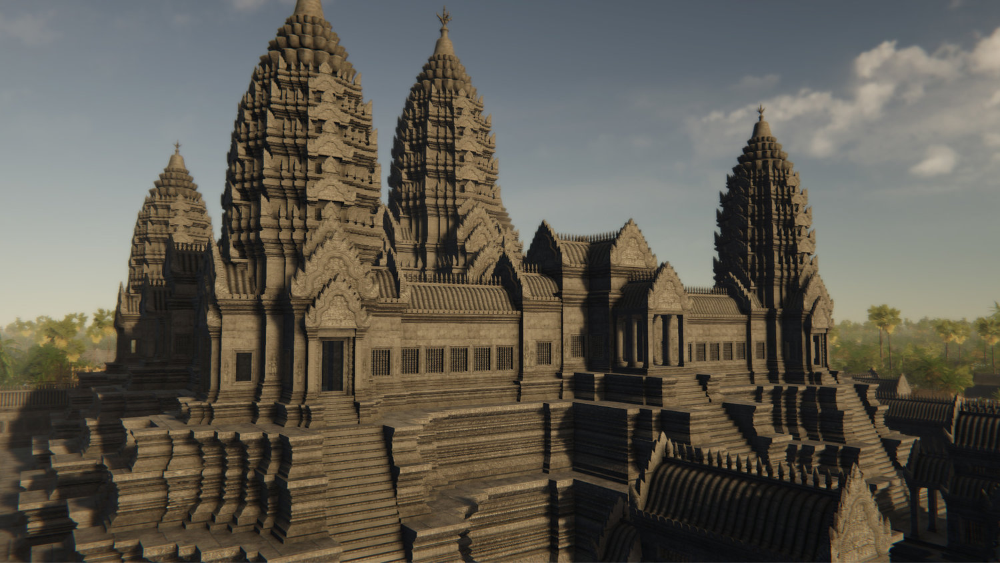
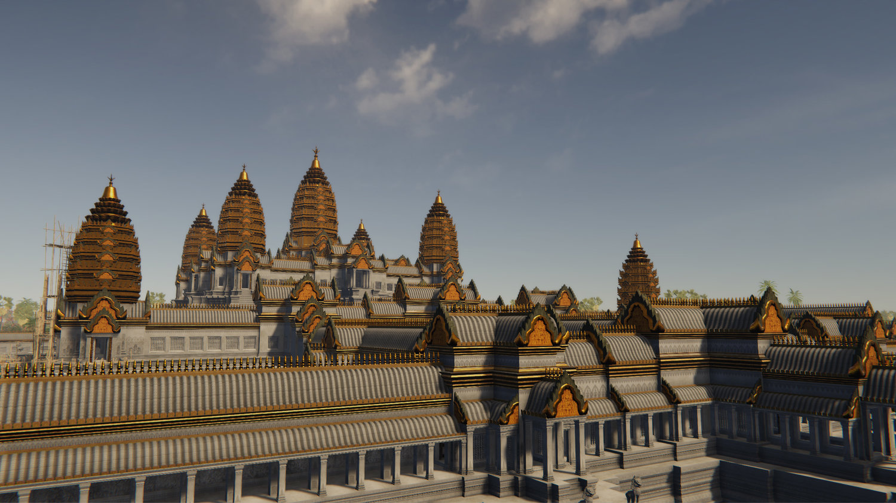

# Prototype Two: 

For my second prototype, I focused on the interaction and animation aspects of my capstone project. My first prototype mainly focused on the layout and the space of my overall project. Thus, when I was presenting my first prototype, people admired how things looked but they had questions regarding how players will interact with the spaces and characters. For example, when people saw the scene of the temple with a dragon, they wondered what players will do with that dragon. Will they fight the dragon or just passively observe what's happening around them? I needed to ponder this question deeply because the role of players in this simulation/game is essential to the narrative of the place.

Initially, I thought that players will be just observers. They will have the freedom to move around in the provided space and see what's happening around them. As I started working and getting feedback from other people, I think it would be a good idea to give them the freedom to be involved in stories as well. For example, players have the freedom to either passively watch a dragon burns down a village or they can step in and fight that dragon. Adding the interaction part will make the project more interesting, but I will not be able to tell my personal stories because players will create their own ones. 

## Stories
I was figuring out stories that I want to animate, so players can watch and interact with. I tried to remember stories told to me by my grandmother, parents, and elders. I also talked to my friends and did some research to find intriguing stories that could capture players' attention.

### Naga: Giant Serpents

Above is an image of a sculptures of a seven-headed naga, a giant mythical serpent that guards the entrance to the Angkor Wat Temple. They represent the guardians of the temple who prevent intruders from entering the temple. 

There are tales of these giant serpents roaming around the temple during ancient time. 

I also consider how detailed 

